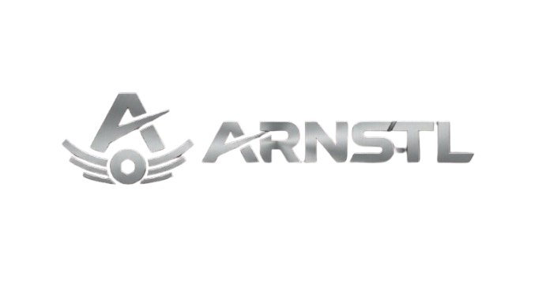

<p align="center">
  
</p>

<h1 align="center">Aeron Steels Private Limited</h1>

<p align="center">
  A full-featured corporate website built for an ISO 9001:2015 certified steel manufacturing and precision component fabrication company based in Rohtak, Haryana.
</p>

<p align="center">
  
  
  
  
  
  
  
</p>

---

## 📖 Overview

A production-ready corporate website for **Aeron Steels Private Limited** — a steel processing and component manufacturing company. The site serves as a digital storefront showcasing the company's product catalog, manufacturing infrastructure, certifications, and services to industrial buyers across India.

Built from the ground up with Next.js 16, this project demonstrates end-to-end implementation of a content-driven business website with a custom CMS backend, image management pipeline, and automated deployment.

---

## ✨ Key Features

### 🏠 Dynamic Home Page
Assembled from reusable section components — Hero, About, Services, Quote Banner, and International Exhibitions — each with scroll-triggered animations and responsive layouts.

### 📦 Product Catalog with CMS Backend
- 68 precision-engineered product images uploaded and served via **Cloudinary CDN**
- Product data stored in **MongoDB** with a Mongoose schema
- Paginated grid view with hover effects and blur transitions
- Individual product detail pages with a fullscreen lightbox viewer
- Automated seed script that reads local images, uploads to Cloudinary, and populates the database in a single command

### 🏭 Infrastructure Gallery
Facility photo gallery with 8 high-resolution images of the manufacturing plant — CNC machines, rolling mills, slitting lines, and more — displayed in a responsive grid with hover zoom.

### 📬 Contact Enquiry System
Server-side contact form processing via Nodemailer with HTML email templates (Mailgen). SMTP-based delivery with input validation and error handling.

### 🔍 SEO & Performance
- Dynamic sitemap generation covering all routes
- Structured JSON-LD (Organization schema) for rich search results
- Open Graph and Twitter card metadata
- Server-side rendering for content pages
- Fully typed with TypeScript 5

---

## 🛠️ Tech Stack

| Area | Technology | Why |
|---|---|---|
| **Framework** | Next.js 16 (App Router) | SSR, file-based routing, Turbopack dev server |
| **Language** | TypeScript 5 | Full type safety across the entire codebase |
| **Styling** | Tailwind CSS v4 | Utility-first, fast iteration, consistent design |
| **Animation** | Framer Motion | Scroll-triggered animations, hover effects, lightbox transitions |
| **Database** | MongoDB + Mongoose 9 | Flexible document model for product catalog |
| **Media** | Cloudinary | Image upload, transformation, and global CDN delivery |
| **Email** | Nodemailer + Mailgen | Transactional email for contact enquiries |
| **Validation** | Zod | Runtime input validation for API endpoints |
| **Deployment** | Vercel | Zero-config deployment, edge network, environment management |

---

## 🏗️ Architecture Highlights

- **Client-Server Separation** — Data-fetching pages (`/products`, `/products/[id]`) use server components with internal API calls, while interactive sections use client components with Framer Motion
- **Component Isolation** — Home page sections are independent, reusable components (`Hero`, `About`, `Services`, `QuoteBanner`, `Testimonials/Exhibitions`), making the layout easy to reconfigure
- **API Layer** — RESTful API routes with pagination, admin authentication via Bearer tokens, rate limiting, and structured error responses
- **Image Pipeline** — Local product images → Cloudinary upload → MongoDB storage → CDN-delivered to the frontend. The seed script handles the entire pipeline automatically
- **Environment Validation** — Strict environment variable validation at startup via a central `env.ts` module, failing fast on misconfiguration

---

## 📁 Project Structure

```
src/
  app/             Pages + API routes
  components/      Reusable React components
  lib/             Utilities (DB, Cloudinary, email, env, validation)
  models/          Mongoose schemas
public/
  photos/          Home and infrastructure images
  images/          Logo and legacy assets
scripts/
  seed-products.ts Automated product seeding pipeline
```

---

## 🚀 Deployment

Deployed on **Vercel** with automated CI/CD via GitHub. Environment variables managed through Vercel's dashboard for production and preview environments.

---

<p align="center">
  <strong>Aeron Steels Private Limited</strong><br />
  📍 Khewat no 1306, Village Baniyani, Bhiwani Road, Rohtak, Haryana 124001<br />
  📧 <a href="mailto:aeronsteels28@gmail.com">aeronsteels28@gmail.com</a> | 📞 +91 8307028125
</p>
